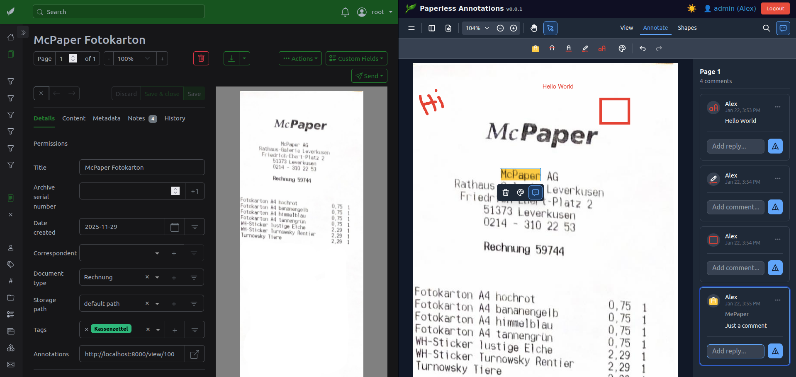
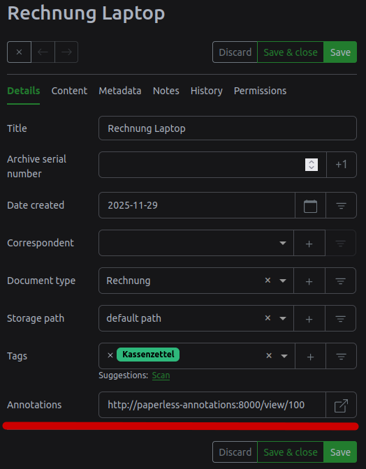
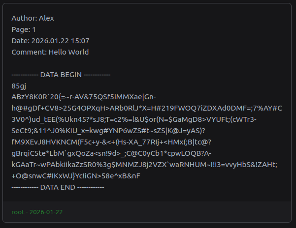

# Paperless Annotations

Add PDF annotations to your [Paperless-ngx](https://github.com/paperless-ngx/paperless-ngx) documents.

## Why?

Paperless-ngx supports document notes, but they lack context: notes are not linked to pages or specific positions within a document.
Paperless Annotations addresses this by allowing highlights, text, and drawings to be added directly to PDFs.



## Tech Stack

- Django 6.0 + Django Ninja (API)
- [EmbedPDF](https://embedpdf.com/) for PDF viewing/annotation
- [uv](https://github.com/astral-sh/uv) package manager
- [npm](https://www.npmjs.com/) to install EmbedPDF

## Setup


### Using Docker

```bash
# Clone the repository
git clone https://github.com/al-eax/paperless-annotations.git

# move to project directory
cd paperless-annotations

# Copy and edit the .env file
cp .env.example .env

# edit .env file and set your Paperless-ngx URL and other variables
docker-compose up -d
```

By default volumes are from `./db` and `./note_annotation.template` to persist the database and access the annotation note template.


### Manual installation

```bash
# Clone and install
git clone https://github.com/al-eax/paperless-annotations.git

# move to project directory
cd paperless-annotations

# Install Python dependencies
# Install uv by running: `wget -qO- https://astral.sh/uv/install.sh | sh`
uv sync

# Install frontend dependencies (EmbedPDF)
npm install

# create .env file
cp .env.example .env

# edit .env file and set your Paperless-ngx URL and other variables

# migrate database
uv run python manage.py migrate

# run development server
uv run python manage.py runserver

# or run gunicorn for production
uv run gunicorn core.wsgi
```

__Note:__ since Paperless Annitations uses some in process memory for caching and threaded background tasks, its recommended to use only one gunicorn worker.


### Create an admin user

Make sure you have your Paperless-ngx API token ready (see Paperless-ngx → My Profile → API Auth Token).
It is required when creating the admin user.

You can create a Django admin user from the command line:

```bash
uv run python manage.py createsuperuser
```

Or use the web-based initializer at `http://<your-server-address>:8000/initialize` (available only when no admin user exists yet).

## Configure via environment variables

- `SECRET_KEY` - Django secret key (choose a random string)
- `DEBUG` - Enable Django debug mode (`true`/`false`); set to `false` in production
- `LOG_LEVEL` - Logging level (e.g. `DEBUG`, `INFO`, `WARNING`, `ERROR`)
- `ALLOWED_HOSTS` - Comma-separated list of allowed hosts
- `PAPERLESS_URL` - URL to your Paperless-ngx instance
- `BASE_URL` - Base URL where Paperless Annotations is hosted (e.g. `http://localhost:8000` or `https://annotations.yourdomain.com`)
- `ANNO_SERIALIZER` - Name of the annotation serializer (see "Customize annotations format" below)
- `ENABLE_AUTO_UPDATE_LINKS` - Enable automatic updating of document links (`true`/`false`)
- `UPDATE_INTERVAL_MINS` - Interval (minutes) for automatic link updates
- `CUSTOM_FIELD_NAME` - Name of the custom field in Paperless-ngx used to store document links
- `ANNO_STORAGE` - Annotation storage backend: `paperless_notes` or `database` (default: `paperless_notes`)

## Auto-update document links

To access annotations directly from Paperless-ngx, each document can be linked to its corresponding Paperless Annotations view via a custom field:



You can enable automatic updating of these links by setting the `ENABLE_AUTO_UPDATE_LINKS` environment variable to `true`.
This will periodically update the links in a custom field of the Paperless-ngx documents.
The name of the custom field can be set using the `CUSTOM_FIELD_NAME` environment variable (default is `Annotations`).

Ensure the `BASE_URL` environment variable points to the base URL where Paperless Annotations is hosted.

The update interval can be configured using the `UPDATE_INTERVAL_MINS` environment variable (default is `60` minutes).


### Annotation Storage

Annotations made to a document can be stored in two ways. 
Both methods can be enabled by setting the `ANNO_STORAGE` environment variable to one of the following values:

- `database` - the internal sqlite database
- `paperless_notes` - directly into Paperless-ngx notes

Both storage methods have their advantages and disadvantages.

### Paperless-ngx notes storage (`paperless_notes`)

__Advantages:__

- Works with the exporter - annotations can be backed up by Paperless-ngx export functionality
- Full-text search for all your annotations by Paperless-ngx (if annotation contains text)

__Disadvantages:__

- Paperless-ngx doesnt support editing notes, so each modification deletes and recreates the note. This increases the note history.
- Each creation, modification or deletion request goes trhough the Paperless-ngx API, which may be slower than direct database access.

### Database storage (`database`)

__Advantages:__

- Fast access to annotations via direct database queries
- No additional load on the Paperless-ngx API
- No note history increase on modifications

__Disadvantages:__

- Annotations are not backed up by Paperless-ngx export functionality
- No full-text search for annotations in Paperless-ngx

### Customize annotations format in Paperless-ngx notes

When `ANNO_STORAGE` is set to `paperless_notes`, you can customize the format of annotations stored in Paperless-ngx notes.

These notes have a specific format consisting of two parts:



#### 1. Human readable upper part

The format of this text can be customized by the file `note_annotation.template` by using [Django Template Language](https://docs.djangoproject.com/en/6.0/topics/templates/).

By default it displays Author, Page, Date, and Content of the annotation:

```
Author: {{author}}
Page: {{page}}
Date: {{created}}
Comment: {{comment}}
text: {{text}}
```

__Note:__ double new lines are eliminated when saving to Paperless-ngx notes to keep the note compact.

Available placeholders can be found in `annostorage.py` and are related to js annotation objects created by EmbedPDF:

```py
context = {
    "author": annotation.author,
    "page": annotation.pageIndex + 1,
    "page_index": annotation.pageIndex,
    "created": created_formatted,
    "comment": annotation.contents or "",
    "text": getattr(annotation, "custom", {}).get("text", None),
    "type": annotation.type,
    "annotation": annotation,
}
```

#### 2. Serialized lower part

The serialized part of the annotation is stored in the lower part of the note.
It is separated from the human readable part by lines of dashes and contains the actual annotation data used to recreate the annotations in Paperless Annotations.

The first line after the dashes indicates the serializer used. The second line contains the serialized annotation data.

The serializer can be customized by setting the `ANNO_SERIALIZER` environment variable to the name of the serializer.
There are two serializers defined in `annostorage.py`:

- `85gj`: The default serializer. It produces non-human-readable content by encoding the annotation JSON to Base85 and applying gzip compression.
- `ji2`: A human-readable serializer that stores pretty-printed JSON.

__Note:__ The serializer may affect full-text searchability of annotation content in Paperless-ngx.


## License

MIT
